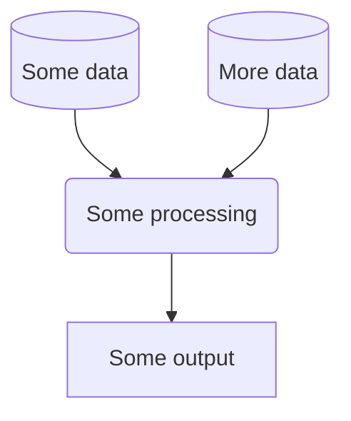

<!--- Badges start --->
       

<!--- Badges end --->

# transport-network-performance

> :warning: This repository is still in the development phase. Caution should
be taken before using or referencing this work in any way - use it at your own
risk.

# Introduction
## About
*Describe what this repo contains and what the project is.*

`transport_performance` provides a method for analysing the efficiency of
moving people into and around urban centres. The method employed here builds
upon that established by [Poelman *et al*, European Commission 2020](https://ec.europa.eu/regional_policy/sources/work/012020_low_carbon_urban.pdf). Specifically, this python package provides logic
useful for:

- Defining an urban centre boundary based upon contiguous population density.
- Inspecting, cleaning and filtering public transit data in [GTFS format](https://gtfs.org/).
- Inspecting and filtering Open Street Map data in [PBF format](https://wiki.openstreetmap.org/wiki/PBF_Format).
- Multimodal routing with r5 [using r5py](https://r5py.readthedocs.io/en/stable/)
to create travel time matrices.
- Calculation of transport performance statistics.

## Developers
We welcome contributions from others. Please check out our
[code of conduct](CODE_OF_CONDUCT.md) and
[contributing guidance](CONTRIBUTING.md###Set-up).

## Installation
*Describe technical set-up. Such as the required dependencies.*

This package is designed to work with python 3.9.13. Full functionality is
tested on macos only. Other operating systems may be incompatible with
`transport_performance.osm` specifically.

The transport modelling logic in `transport_performance.analyse_network`
depends upon a compatible Java Development Kit (JDK). Please consult the
[r5py installation docs](https://r5py.readthedocs.io/en/stable/user-guide/installation/installation.html#dependencies)
and our [Contrubuting Guidance](/./CONTRIBUTING.md) for more on configuring a
JDK.

## Usage
*Explain how to use the things in the repo.*

### Workflow
<!-- *You may wish to consider generating a graph to show your project
workflow. GitHub markdown provides native support for
[mermaid](https://mermaid.js.org/syntax/flowchart.html), an example of which is
provided below:* -->

# Data Science Campus
At the [Data Science Campus](https://datasciencecampus.ons.gov.uk/about-us/) we
apply data science, and build skills, for public good across the UK and
internationally. Get in touch with the Campus at
[datasciencecampus@ons.gov.uk](datasciencecampus@ons.gov.uk).

# License
<!-- Unless stated, the codebase is released under [the MIT Licence][mit]. -->

The code, unless otherwise stated, is released under [the MIT Licence][mit].

The documentation for this work is subject to [© Crown copyright][copyright]
and is available under the terms of the [Open Government 3.0][ogl] licence.

[mit]: LICENCE
[copyright]: http://www.nationalarchives.gov.uk/information-management/re-using-public-sector-information/uk-government-licensing-framework/crown-copyright/
[ogl]: http://www.nationalarchives.gov.uk/doc/open-government-licence/version/3/
