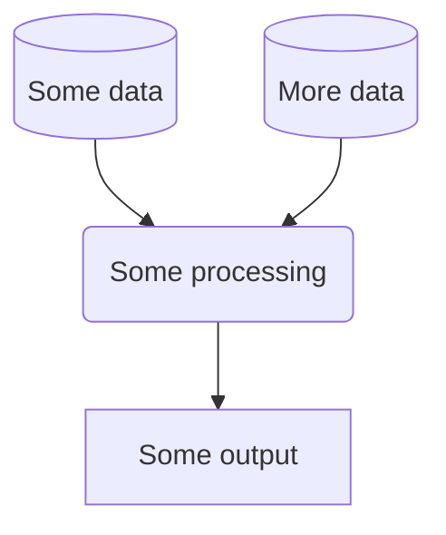

# Repository name

# Introduction
## About
*Describe what this repo contains and what the project is.*

## Installation
*Describe technical set-up. Such as the required dependencies.*

### Pre-commit actions
This repository contains a configuration of pre-commit hooks. These are language agnostic and focussed on repository security (such as detection of passwords and API keys). If approaching this project as a developer, you are encouraged to install and enable `pre-commits` by running the following in your shell:
   1. Install `pre-commit`:

      ```
      pip install pre-commit
      ```
   2. Enable `pre-commit`:

      ```
      pre-commit install
      ```
Once pre-commits are activated, whenever you commit to this repository a series of checks will be executed. The pre-commits include checking for security keys, large files and unresolved merge conflict headers. The use of active pre-commits are highly encouraged and the given hooks can be expanded with Python or R specific hooks that can automate the code style and linting. For example, the `flake8` and `black` hooks are useful for maintaining consistent Python code formatting.

**NOTE:** Pre-commit hooks execute Python, so it expects a working Python build.

## Usage
*Explain how to use the things in the repo.*

### Workflow
*You may wish to consider generating a graph to show your project workflow. GitHub markdown provides native support for [mermaid](https://mermaid.js.org/syntax/flowchart.html), an example of which is provided below:*




# Data Science Campus
At the [Data Science Campus](https://datasciencecampus.ons.gov.uk/about-us/) we apply data science, and build skills, for public good across the UK and internationally. Get in touch with the Campus at [datasciencecampus@ons.gov.uk](datasciencecampus@ons.gov.uk).

# License

<!-- Unless stated otherwise, the codebase is released under [the MIT Licence][mit]. -->

The code, unless otherwise stated, is released under [the MIT Licence][mit].

The documentation for this work is subject to [© Crown copyright][copyright] and is available under the terms of the [Open Government 3.0][ogl] licence.

[mit]: LICENCE
[copyright]: http://www.nationalarchives.gov.uk/information-management/re-using-public-sector-information/uk-government-licensing-framework/crown-copyright/
[ogl]: http://www.nationalarchives.gov.uk/doc/open-government-licence/version/3/
