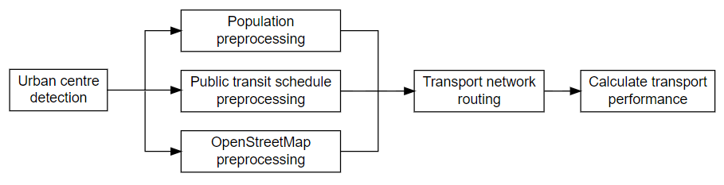

This page provides an overview of `transport_performance` and how it can be
used to analyse transport networks. It discusses the main methods and tools
used within the package and provides links to additional resources for further
reading. In particular, this page presents a methodology for assessing the
performance of urban centre public transit networks using
`transport_performance`. Although, it is possible to modify and extend the
approach presented on this page to suit the requirements of most transport
analyses including:

- Analysis area (no strict requirement on using urban centres).
- Date of analysis
- Time of day
- Transport modes such as walking, cycling, public transit, private car (can even be multi-modal)
- Maximum journey duration

::: {.callout-note}

This page does not cover retrieving input data or `transport_performance` API
usage. See the [how-to](../../how_to/index.qmd),
[tutorials](../../tutorials/index.qmd), and
[API reference](../../reference/index.qmd) pages for more information on these
aspects.

:::

`transport_performance` can be used to assess urban centre public transit
performance by following main calculation stages as shown in @fig-tp-methods.

::: {#fig-tp-methods layout-nrow=1}

An overview of a methodology for calculating the transport performance of
urban centre public transit networks using `transport_performance`.

:::

The process starts with urban centre detection. This definition was created by
Eurostat, and represents high density population clusters (see the [Eurostat
level 1 degree of urbanisation methodology document][eurostat-uc] for more
details). In short, it is a cluster of contiguous 1 Km2 grid cells
with a density of at least 1,500 inhabitants/Km2 and a total
population of at least 50,000. This definition is advantageous since it can be
applied consistently internationally.

`transport_performance` currently works with gridded population estimates. Such
a data source is the [Global Human Settlement Layer][ghsl] (GHSL). The
[GHSL-POP][ghsl-pop] layer provides high resolution estimates with worldwide
coverage. It uses combined satellite imagery and national census data to
produce population estimates down to 100 metre grids (see [section 2.5 of the
GHSL technical paper][ghsl-pop-methods] for more details). Using
`transport_performance` it is also possible to reaggregate gridded population
estimates (e.g. from 100m to 200m grids) as a balance between achieving
granular results and performance at the transport network routing stage.

When considering public transit performance, schedule data is a core input (for
other modalities this step is not required). The widely adopted [General
Transit Feed Specification (GTFS)][gtfs-overview] data are required for
defining the public transit network within `transport_performance`. This is
scheduled data, therefore the effects of delays (such as traffic) are not
accounted for in the final transport performance results.
`transport_performance` provides a range of GTFS validation, cleaning, and
filtering methods to pre-process the inputs for use during the transport
network routing stage.

The underlying road/path network is built using [OpenStreetMap][osm]
(OSM) data. OSM is an open, community-maintained source of map data worldwide.
OSM data provides the spatial information about the street network, such as
road and pathway locations, speed limits, transport rules and junction
locations. With `transport_performance` it is possible to optimise these data
by  spatially filtering these the area of interest (using [Osmosis]) and
removing OSM features
that are not required for transport routing (such as buildings and waterways).

The transport network routing stage calculates the feasible journey travel
times over multiple departure times. This package uses [R5py][r5py],
which is a wrapper of [Conveyal's R5][r5] - a highly performant
transport routing engine based on [RAPTOR (Round-Based Public Transit Routing)][raptor].
It is also is highly configurable and caters for a range of transport modalities,
including public transit, private car, cycling, and walking. This improves upon
the ONS Data Science Campus' [previous transport modelling work][dsc-otp] by
calculating robust median travel times over many journeys. Indicative travel
times at a single journey departure time can vary significantly, depending on
the public transport service availability within the locality of the journey.
Running the model across multiple consecutive journeys produces statistics that
fairly represent journey travel times within a given area. For more details see
[Fink, Klumpenhouwer, Saraiva, Pereira, and Tenkanen (2022)][r5py-paper]
and [Conway, Byrd, and van der Linden (2017)][r5-paper].

The final stage uses the network routing results (travel times) to calculate
the transport performance. See the [Transport Performance: A Definition](../what_is_tp/index.qmd)
page for more details on this step.

::: {.callout-note}

For more information on the known `transport_performance` package limitations,
see the [limitations and caveats](../limitations/index.qmd) page.

:::

[eurostat-uc]: https://ec.europa.eu/eurostat/documents/3859598/15348338/KS-02-20-499-EN-N.pdf/0d412b58-046f-750b-0f48-7134f1a3a4c2?t=1669111363941#page=35
[ghsl]: https://human-settlement.emergency.copernicus.eu/dataToolsOverview.php
[ghsl-pop]: https://human-settlement.emergency.copernicus.eu/download.php?ds=pop
[ghsl-pop-methods]: https://human-settlement.emergency.copernicus.eu/documents/GHSL_Data_Package_2023.pdf?t=1698413418
[gtfs-overview]: https://gtfs.org/schedule/
[osm]: https://www.openstreetmap.org/about
[r5py]: https://r5py.readthedocs.io/en/stable/
[r5]: https://github.com/conveyal/r5
[raptor]: https://www.microsoft.com/en-us/research/wp-content/uploads/2012/01/raptor_alenex.pdf
[r5py-paper]: https://zenodo.org/records/7060438
[r5-paper]: https://core.ac.uk/reader/223242270
[dsc-otp]: https://datasciencecampus.ons.gov.uk/using-open-data-to-understand-hyperlocal-differences-in-uk-public-transport-availability/
[Osmosis]: https://wiki.openstreetmap.org/wiki/Osmosis
