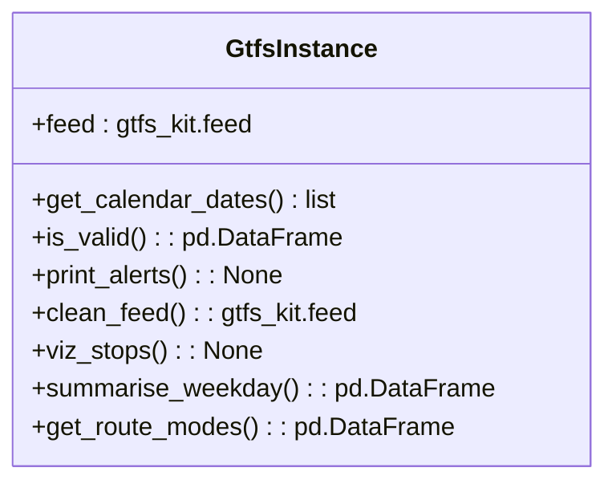

# GtfsInstance

<header>
    
</header>

```mermaid

classDiagram
    class GtfsInstance {
        +feed : gtfs_kit.feed
        +get_calendar_dates() list
        +is_valid() : pd.DataFrame
        +print_alerts() : None
        +clean_feed() : gtfs_kit.feed
        +viz_stops() : None
        +summarise_weekday() : pd.DataFrame
        +get_route_modes() : pd.DataFrame
    }

```
