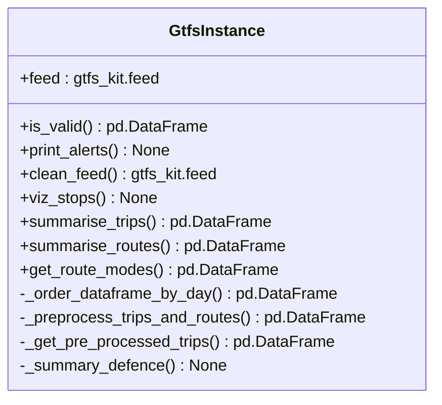

# GtfsInstance

```mermaid

classDiagram
    class GtfsInstance {
        +feed : gtfs_kit.feed
        +is_valid() pd.DataFrame
        +print_alerts() None
        +clean_feed() gtfs_kit.feed
        +viz_stops() None
        +summarise_trips() pd.DataFrame
        +summarise_routes() pd.DataFrame
        +get_route_modes() pd.DataFrame
        -_order_dataframe_by_day() pd.DataFrame
        -_preprocess_trips_and_routes() pd.DataFrame
        -_get_pre_processed_trips() pd.DataFrame
        -_summary_defence() None
    }

```
